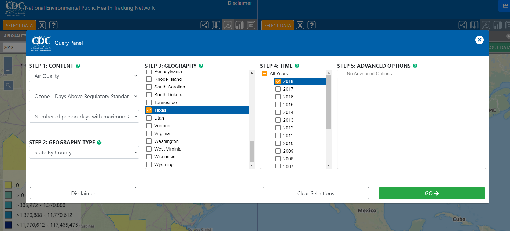
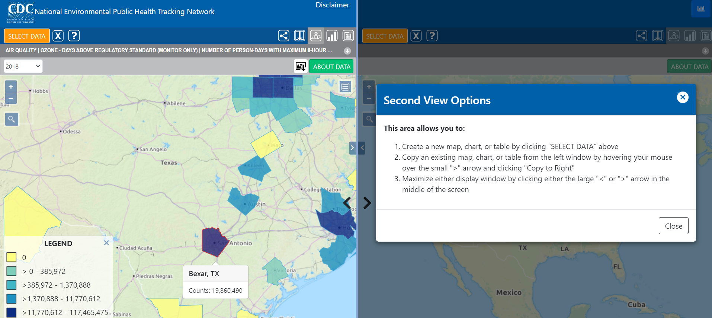
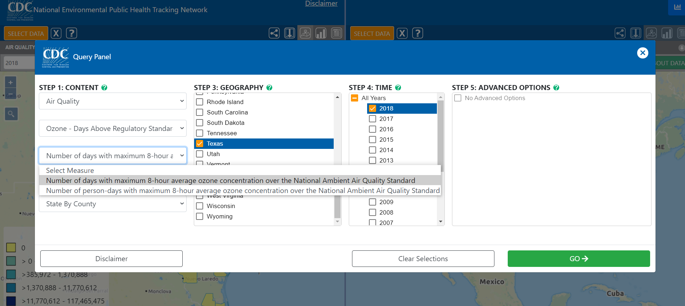
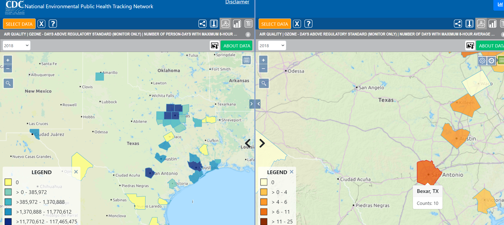
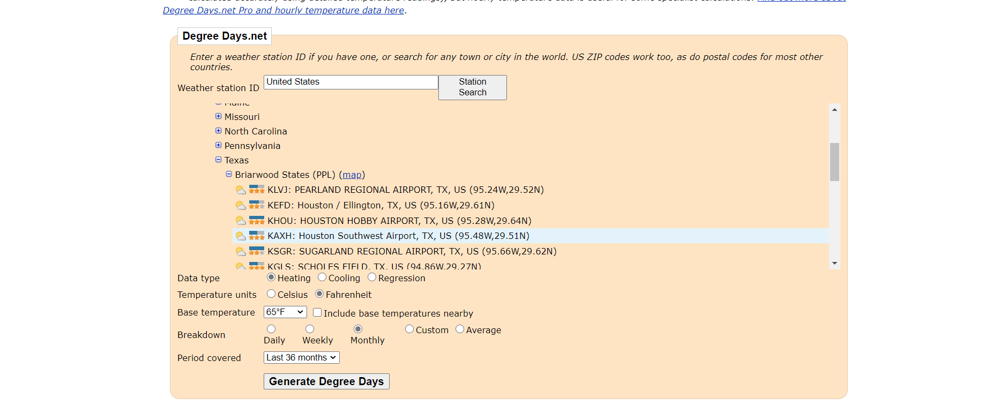
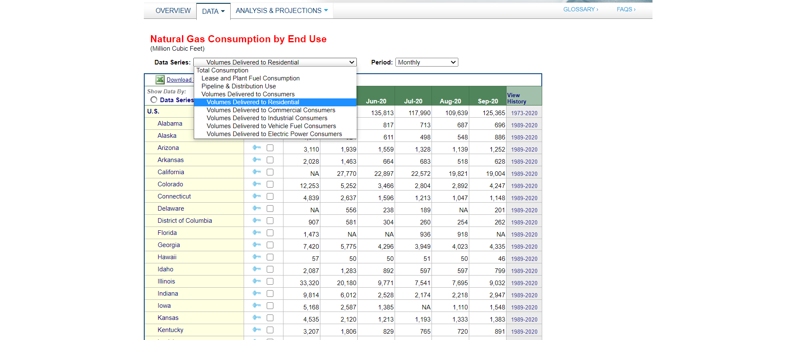
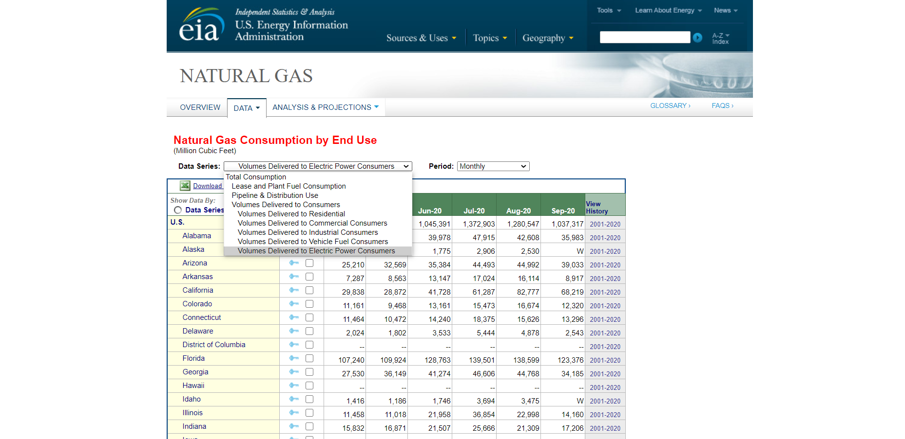

# Cost Benefit Analysis



## Measuring the Health Impact

The first step in the cost-benefit analysis will be to acquire health data from the [National Environmental Public Health Tracking Network](https://ephtracking.cdc.gov/DataExplorer/#/).

**From the portal:**

Under Step 1, choose:

* Select Content Area: Air Quality
* Select Indicator: Ozone days above regulatory standard \(Monitor Only\)
* Number of person-days with maximum 8-hour average ozone concentration over the National Ambient Air Quality Standard

Under Step 2, select State by County

Under Step 3, select the desired State

Under Step 4, select the time of study


The Result will resemble the image below. For Example, in San Antonio, Texas, the closest monitoring station \(Bexar, TX\) recorded 19,860,490 person-days ozone exceedance over the National Ambient Air Quality standard. We will use this number to calculate the number of people being exposed to this exceedance.


There will be an option to add another map on the right hand of the screen. Navigate to “Select Data” on the right hand side and repeat the steps conducted above. All steps remain the same. The only difference here is the measure chosen under step 1 on the online resource. For Select Measure, choose the Number of days with a maximum 8-hour average ozone concentration over the National Ambient Air Quality Standard. All other inputs remain the same.

This will output the number of days under the chosen timeframe that the ozone National Ambient Air Quality Standard was exceeded.

The results below are an example showcasing the number of days, in San Antonio,TX, where the National Ambient Air Quality Standard was exceeded. For San Antonio, it can be seen that the number of days exceeded was 10 in 2018.

### Determining Exposure to Increased Ozone Levels

Dividing "the number of person-days with maximum 8-hour average ozone concentration over the National Ambient Air Quality Standard" by "the number of days with maximum 8-hour average ozone concentration over the National Ambient Air Quality Standard"


For San Antonio, this was determined to be 19,860,490 person-days / 10 days = 1.9 million people.


### Determining Vulnerability Caused by Respiratory Illness


The national average is used in place of access to local data. Feel free to substitute any locally available data. 


Next, navigate to the following online resource:

[A recent study from the AJMC from 2014](%20https://www.ajmc.com/view/chronic-respiratory-disease-death-toll-rising-in-recent-decades), shows that the nationwide respiratory disease mortality rate is 52.9 deaths per 100,000.

Using this figure in combination with the percentage of people exposed to high levels of ozone, we can compute the expected number of deaths caused by ozone exposure. 

$$
Exposed Population / 100,000 * Respirator Mortality Rate = \textrm{Expected Dealths}
$$


For example, in San Antonio, the number of deaths is found to be 1.9 million people / 100,000 \*52.9 = approx. 1,000 people.


According to the EPA, the value of a statistical life is $10,000,000 USD, which can be used in a net benefit calculation based on the number of lives saved by reducing ozone. 

$$
Net Benefit = VSL * Lives Saved
$$


 For San Antonio, this would amount to 1,000 people \* VSL = $ 10 billion USD.


### Determining the Amount of Cooling Required to Achieve Benefit

A study conducted by the EPA suggests that ozone levels were reduced by 0.6 - 4.6 ppb for every degree Fahrenheit reduction in air temperature. We assumed it was the average, 2.6 ppb/F. 

The next step is to determine the amount, in parts per billion \(bbp\) of ozone for the region in question. 

Calculating the required reduction in Air Temperature from San Antonio is as follows:

$$
\textrm{Required Reduction} = \frac{\textrm{Ozone Levels PPB}}{2.6 \frac{PPB}{Deg}}
$$

There is minimal information on the capability of cooler pavements to reduce Air Temperature. Because of this, no calculation has been done on the CBA Excel file to estimate the total amount of sqf required in the study area to realize the health benefit. A tab with pre-defined functions has been included. Once future data sets are acquired concerning the ability of cooler pavement to reduce air temperature per square foot installed, you may input this to get an idea of the total square foot required.

### Measuring Energy Reductions

Navigate to [BizEE Degree Days Calculator](https://www.degreedays.net/#): 

Under Weather Station ID: Input the desired study area name and choose the nearest weather station

Get the **monthly** Heating Degree Days \(HDD\) and Cooling Degree Days \(CDD\) over the Last **36 months** with a base temperature of **65 F.**

The next step is to calculate the additional energy required for space heating and the energy savings from reduced cooling needs. These are divided into two different steps:

#### Calculating Additional Energy Required for Heating

Using the data from BizEE, calculate the average monthly HDD for the winter \(Dec, Jan, Feb\) months and summer \(Jun, July, Aug\) months.

From the [US Energy Information Administration Natural Gas Consumption Data](https://www.eia.gov/dnav/ng/ng_cons_sum_a_EPG0_veu_mmcf_m.htm), download the data for usage over the same timeframe as the HDD data as shown below. 

On the top left of the web page, under **“Data Series”** choose **“Volumes Delivered to Residential.”** Navigate to the row that shows the state where the study area is located. Click on the last column that allows you to view the history of energy consumption.

Again, average the summer and winter months. 

Once done,  use the following calculation to find the amount of natural gas consumed per degree of air temperature heated. 

$$
3months*\frac{\textrm{Winter NG Consumption} - \textrm{Summer NG Consumption}}{\textrm{HHD Winter} - \textrm{HDD Summer}}
$$

To find the Natural Gas Prices, navigate to [US Energy Information Association Natural Gas Prices Data ](https://www.eia.gov/dnav/ng/ng_pri_sum_a_EPG0_PRS_DMcf_m.htm)

Conduct the necessary conversions to calculate the dollar value attributed to increased Natural Gas consumption from a degree F reduction in air temperature.

Given that there are inconclusive results on the amount of air temperature reduction attributed to a square foot of cooler pavements, the cost will be expressed on a per Fahrenheit basis.

#### Calculating Reduced Energy Consumption Due to Lower Cooling Needs

Using cooling degree days \(CDD\), conduct the same analysis as done for the HDD

Next, we need to get the corresponding monthly energy use over the chosen time period.

Navigate to the [US Energy Information Association Natural Gas Prices Data ](https://www.eia.gov/dnav/ng/ng_pri_sum_a_EPG0_PRS_DMcf_m.htm)to download data on Electric Power Consumption as shown below

On the top left of the web page, under **“Data Series”** choose **“Volumes Delivered to Electric Power Consumers”** Navigate to the row that shows the state where the study area is located. Click on the last column that allows you to view the history of energy consumption.

Record the Natural Gas Deliveries to Electric Power Consumers over the months for which we have information on CDDs. By now, you should have data for summer month Natural Gas Deliveries to Electric Power Consumers compared to to the winter months. Notice how the consumption goes up during summer months.

Next, get the average Natural Gas Deliveries to Electric Power Consumers over the winter and summer months.

After doing so, calculate the monthly natural gas usage per one degree increase in air temperature.

$$
\frac{\textrm{Summer Consumption} - \textrm{Winter Consumption}}{\textrm{CDD Summer} - \textrm{CDD Winter}}
$$

The formula above allows us to get the monthly natural gas deliveries to electric --power consumers attributed to a degree Farenheit increase in air temperature. Multiply it by the average number of summer months to get the annual increase in consumption per degree Farenheit.

On average, there is 0.2931 kWh of electricity produced per cubic foot of natural gas at the utility. Use this number, or any future numbers \(may change due to technological advancements\), to calculate the Expected kWh removed per degree Farenheit decrease in air temperature.

Using the cost of kWh of electricty for area in question and the increase in natural gas usage per one degree increase in temperature, calculate the dollar value attributed to decreased energy use from one degree farenheit reduction in air temperature.

Given that there are inconclusive results on the amount of air temperature reduction attributed to a square foot of cooler pavements, the benefit will be expressed on a per Fahrenheit basis.

Finally, net the increased costs of natural gas against the decreased costs of energy to get the net benefit attributed to a degree Farenheit reduction in air temperature by cooler pavements.

This step can be taken further by looking at the energy profile in the study area to determine the net carbon emissions reduced and the underlying monetary value based on the current carbon cost.

Now that the steps are complete, your excel sheet should have two main benefits:

1.  The expected benefit from energy reductions per Degree Fahrenheit reduction in air temperature. Once there is enough data on the ability of cooler pavements to reduce air temperature, you can factor that in based on the total square miles of cooler pavement coatings installed.
2. The required reduction in air temperature to achieve a maximum benefit in terms of health. For San Antonio, it was found that a reduction in the air temperature of around 5-6 degree F would result in an average expected benefit of $10 bill in terms of lives saved. Once future data is available on the ability of cooler pavements to reduce air temperature, you may calculate the total required square miles of cooler pavements that would allow the study area to reach a maximum benefit in terms of lives saved.

