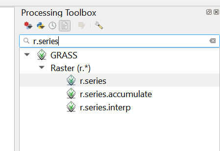

# Demonstration Siting Index

## Collecting Data from Social Explorer

First, collect data on poverty, health insurance and age ranges by census tract from [Social Explorer](https://www.socialexplorer.com/explore-maps). Create a free Social Explorer account if you do not have access to one already. Once done, select “Create new…” and then select “Report”.

Select the report you are interested in, which will be the, “American Community Surveys \(5-Year Estimates\)” report. Be sure to select the most recent of report types.

Then, under “Select a Geographic Type: choose “140…Census Tract” and after select your state and county from the dropdown lists. Next, select “All census tracts in &lt;your county&gt;” and then click “Add” to add it your “Current Geography Selections” list. Then click, “Proceed to Tables” to select your data points.

From the data list select and add, “A01001, Age”, “A20001 Health Insurance”, and “A13004 Ratio of Income in 2018 to Poverty Level” \(or “Ratio of Income in &lt;most recent year available&gt; to Poverty Level”\). Once the three parameters have been added to your Current Table Selections, click “Show Results”.

Next, navigate to the“Data Download” tab. Under “Output Options”, select “Output column labels in the first row”. Then, below “Download data by geography type”, click “Census Tract data \(CSV\)" to download the report as a CSV file.

Once done, save the CSV file as an XLS file.

## Format Data Using Template Excel Spreadsheet



Using your saved XLS version of the Social Explorer report, copy columns A-D \(excluding headers, start to Copy from Row 3\) which should include all data below the headers, Geo\_FIPS, Geo\_GEOID, Geo\_NAME, and GeoQName.

Then paste that data to the Screening Tool Template Excel file, under the header that aligns. In other words, in the Screening Template Template Excel, click into cell L5 and paste there. This will ensure that the headers and data will match up. See screenshots below.

Next, do the same for columns BD to CB in the Social Explorer report. They should appear in the order you see below. Here again, start at Row 3 \(excluding headers\) and be sure to include all rows of data below to copy. Screenshot for reference, further below.

1. Total Population:
2. Total Population: Under 5 Years
3. Total Population: 5 to 9 Years
4. Total Population: 10 to 14 Years
5. Total Population: 15 to 17 Years
6. Total Population: 18 to 24 Years
7. Total Population: 25 to 34 Years
8. Total Population: 35 to 44 Years
9. Total Population: 45 to 54 Years
10. Total Population: 55 to 64 Years
11. Total Population: 65 to 74 Years
12. Total Population: 75 to 84 Years
13. Total Population: 85 Years and Over
14. Population for Whom Poverty Status Is Determined:
15. Population for Whom Poverty Status Is Determined: Under .50
16. Population for Whom Poverty Status Is Determined: .50 to .74
17. Population for Whom Poverty Status Is Determined: .75 to .99
18. Population for Whom Poverty Status Is Determined: 1.00 to 1.49
19. Population for Whom Poverty Status Is Determined: 1.50 to 1.99
20. Population for Whom Poverty Status Is Determined: 2.00 and Over
21. Total:
22. Total: No Health Insurance Coverage
23. Total: with Health Insurance Coverage
24. Total: with Health Insurance Coverage: Public Health Coverage
25. Total: with Health Insurance Coverage: Private Health Insurance

Once done, columns A-L in the Screening Tool Template Excel file will autopopulate with the data points you will need to submit to GIS. **Check that all calculated fields are dragged down to capture all data in the adjacent rows.**

In the Screening Tool Template Excel file, navigate to the “WEIGHTS” tab in to adjust the weights of the three social parameters, “Poverty”, “Insurance”, and “Age”. This will update score depending on which social parameters you would like to value or you can keep all equal by setting the all weights to “1”.


The “OUTPUT” tab is a direct copy of the final calculated columns from your “DATA” tab. This “OUTPUT” tab will be used in GIS. Again, **check that all calculated fields are dragged down to capture all census tract data from the “DATA” tab.**


## Download Data from Earth Explorer


If you have not already done so, create an account on the [USGS earth explorer online data acquisition tool.](https://earthexplorer.usgs.gov/)


### Setting Filters

#### Set the geographic region by searching for location.

Next, click on the table row with the appropriate place to add it to the filter list.

#### Set Date Range

Select the past three years and the summer months of June, July and August. The more data you include, the more accurate the results will be, however the tradeoff is extended processing time and sacrificed computer memory.

#### Set Cloud Cover

Select from 0% - 10% cloud cover. Images with too much cloud cover will not yield accurate results.

### 

### Selecting the Landsat OLI Level 1 Data Sets

In the datasets tab, select the Landsat 8 OLI Level 1 data, which includes the appropriate bands to compute the NDVI and Land Surface Temperature.

### Placing an Order for Images

From the Results tab, review the selections and then add all images to bulk download. All Landsat 8 Level 1 images should have this download options.

Once the order is placed, you should receive an email when the order is ready and all pre-processing is completed. Make sure you have the [USGS Bulk Download Application \(BDA\)](https://dds.cr.usgs.gov/bulk) installed on your computer. In order to install this application, you must first have a version of the Java Runtime Environment \(JRE\) installed on your computer.


Finally, login to the BDA desktop application and complete the download to your computer. **You do not need to decompress the downloaded files** once the download has completed.


## Processing the Raster Images

In QGIS, install the RS&GIS plugin, which contains python scripts to process the raster images.

Next, open the application and select “compressed files” from the first dropdown to tell the script to decompress the files before processing. Then open the file browser to select the downloaded files from the BDA. If you did not change the default path for downloading from the BDA, the files will be located at “C:\Program Files\bda”

As shown in the image above, also select the NDVI and LST outputs. Once you are satisfied, select “Start Processing” to begin the data processing. Depending on the number of raster files, this might take more than 10 minutes. A file browser window will open to show you the location of the output files. The output will be located in the newly created output folder “\GCCADATA\Landsat 8 OLI\_TIRS C1 Level-1\NITK\_RSGIS\_20201128\_161631\Outputs”


Make sure the directory in which your files are located have sufficient read and write permissions.


### Processing the NDVI and LST Outputs

Once the previous step is completed, load the raster layers into a new QGIS project. The next step is to average all the processed raster images to create a representation of the NDVI and LST for a given region. To do this, we will use the r.series QGIS tool.

Select the relevant layers to process. \(All the LST raster images or all the NDVI raster images\)

Select the aggregate operations “Average” as the output.

Other options can be left the same. Then press run to produce a new raster output that is an average of the selected raster.

Repeat this step for both NDVI and LST individually.


Once the averages have been calculated, you can remove the individual LST and NDVI layers to allow the application to run more quickly. Also, you should save the newly created average layers permanently so they can be accessed later if needed.


### Conduct Zonal Analysis for Raster Images

Since the index is conducted on a per census tract area, we need to average the NDVI and LST measurements using the census tract boundaries.

To do this, you will need to load a vector layer of your city or counties census tracts. This is often found on a city or county GIS portal.

Once this vector layer is loaded into the project, use the Zonal Statistics plugin that comes as a processing tool of QGIS.

You will do this step twice for both the LST and NDVI measurements. Then, select the appropriate aggregated layer and the “Mean” statistic to calculate.

Next, select run for each of the raster layers. This will add the statistics to the vector layer attributes table, which can be found by right clicking on the layer from the layers pane.

Once you are confident that you have done this correctly, you may merge this data with the social score data stored in the Screening Tool template Excel file from the first part of this guide.

### Merging Census Data from Excel with Landsat Data

Load the Screening Tool Template Excel data from the OUTPUT tab into QGIS by double clicking it from the Browser pane.

Next, open the properties window for the census vector layer in QGIS that has the average NDVI and LST measurements by census tract. Navigate to the Joins menu.

Add a new Join by selecting the + sign from the bottom of the window. Select the OUTPUT tab from the Screening Tool Template Excel file as the layer to join and the GEO\_ID as the field to join. The GEO\_ID identifies the census tracts. Select the same field in the census data. You can double-check that these two fields are formatted the same in the attributes table for each file.

Select OK and then Apply to apply the merge. Next, open the attributes table from the layers pane to ensure the join worked and data from both files is populated in the columns.

At this point, you can calculate your final score by using the QGIS field calculator found in the attributes table. Since NDVI is already a normalized parameter between -1 and 1, there is no other pre-processing that needs to be done. For LST, you should normalize the values for a similar range by choosing a minimum and maximum value depending on the region. For instance, you may want to normalize between 20 degrees C and 40 degrees C for warmer climates. To do this, create a new normalized LST field that has the equation.

$$
NormalizedLST = \frac{LST - MIN(LST)}{MAX(LST)-MIN(LST)}
$$

Make sure the data type is "double" for this field, which can represent non-integers.

Next, combine the social and physical data by creating another field. You can adjust with different weights for each parameter or simply use an equal weighting based on your preference. However, you will want to weigh the NDVI parameter negatively as this parameter, in particular, has a negative impact on Urban Heat Island \(UHI\) effect. Example equation below:

$$
\textrm{Siting Score} = 0.5 * LST - 0.5*NDVI + 3*\textrm{Social Score}
$$

If you have combined any additional local data into your census tract vector layer that you want to include in the score, this is an appropriate time to work this data into the overall equation. Choose weights for the city you are anlysing based on local political and environmental conditions. 


Once you have created a field for your overall score, it is time to create a choropleth map.


## Mapping the Demonstration Siting Score

Creating a map is rather easy once the previous steps have been completed. First, open up the properties window for your combined layer. From the symbology window, choose the “Graduated” symbol type.

Next, choose the value \(your final score\) that you wish to chart. Then choose a method for classifying the data. Natural Breaks often produces the best results in this scenario because it separates out a few outliers that have the highest score. Also, chose a color ramp that has more than one color shade in order to easily distinguish different areas. Click ‘OK’ to complete the choropleth configuration.

At the end, you should see a final map with your score which will allow you to easily identify areas of the city that, according to the criteria outlined in the project or any additional parameters, are best for demonstrating the effectiveness of cool pavement projects.

San Antonio Example Output:

\*\*\*\*

